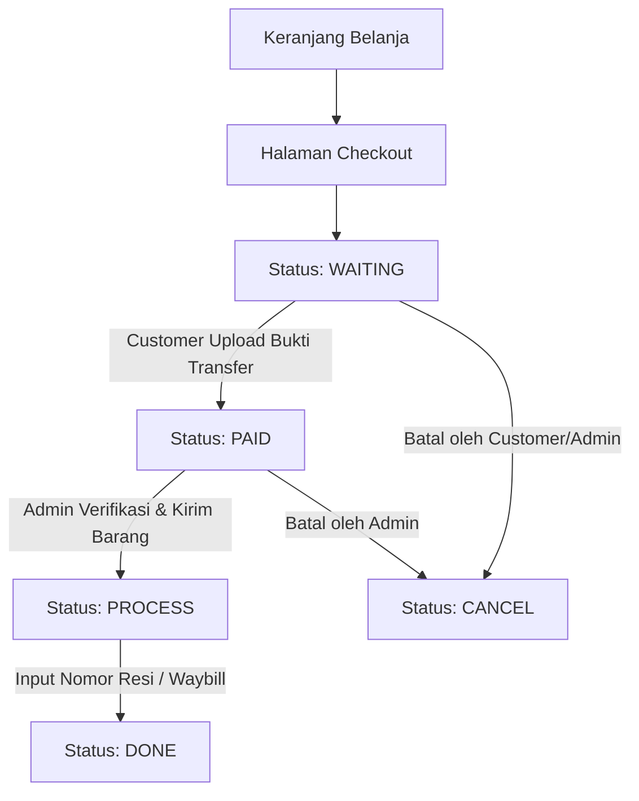

# 01. Business Requirement Document (BRD) - Nomadenstuff E-Commerce

## 1. Latar Belakang & Mengapa Proyek Ini Dibuat
Perkembangan industri busana (*fashion*) dan gaya hidup menuntut pelaku usaha untuk memperluas jangkauan pasar hingga ke seluruh pelosok Nusantara. **Nomadenstuff** diciptakan untuk memodernisasi proses transaksi ritel busana berbasis offline/manual menjadi platform e-commerce digital yang dapat diakses 24/7 oleh siapapun, kapanpun, dan di manapun.

Sebelum adanya sistem ini, proses pemesanan dan pengiriman barang memakan waktu lama karena kalkulasi ongkos kirim dilakukan secara manual oleh Customer Service (CS) dan sering terjadi inkonsistensi pencatatan transaksi. Melalui aplikasi ini, seluruh alur penjualan dari penjelajahan katalog, konfirmasi stok, kalkulasi ekspedisi, hingga verifikasi pembayaran diotomatisasi secara terintegrasi.

---

## 2. Target Bisnis & Key Performance Indicators (KPI)

### A. Tujuan Bisnis Utama (Business Value)
1. **Perluasan Pasar**: Menghubungkan calon pembeli di seluruh Indonesia tanpa batasan lokasi toko fisik.
2. **Otomatisasi Operasional**: Mengurangi beban operasional tim CS dalam menjawab inquiry tarif pengiriman dan total belanja secara manual.
3. **Integritas & Keamanan Transaksi**: Menjamin kepastian akuntansi dengan memastikan tidak ada manipulasi harga (*Price Tampering*) dari sisi client.
4. **Transparansi & Akuntabilitas**: Menyediakan bukti invoice otomatis, pelacakan status pesanan, dan laporan keuangan format PDF yang akurat bagi pengelola toko.

### B. Indikator Keberhasilan (KPIs)
- **Tingkat Konversi Order**: Mencapai rasio checkout hingga pembayaran sukses > 85%.
- **Efisiensi Waktu Pemrosesan Pesanan**: Memangkas waktu pemrosesan order dari 24 jam menjadi < 2 jam setelah pembayaran dikonfirmasi.
- **Akurasi Biaya Kirim**: 100% biaya pengiriman sesuai dengan tarif resmi ekspedisi via integrasi RajaOngkir API.

---

## 3. Siklus Hidup Pesanan (Order Lifecycle)

Pesanan dalam sistem Nomadenstuff mengikuti alur status yang ketat dan terstruktur:

### Penjelasan Status Pesanan:
- **`waiting`**: Pesanan berhasil dibuat, menunggu pembayaran dan upload bukti transfer dari pembeli.
- **`paid`**: Pembeli telah mengunggah bukti bayar transfer bank, menunggu konfirmasi/verifikasi admin.
- **`process`**: Admin memverifikasi dana masuk, menyiapkan barang, dan menginput nomor resi (*waybill*) ekspedisi.
- **`done`**: Pesanan telah selesai dikirim dan diterima oleh pembeli.
- **`cancel`**: Pesanan dibatalkan oleh pembeli atau admin (misal: stok habis atau transaksi kedaluwarsa).

---

## 4. Aturan Bisnis Keuangan & Perhitungan Harga

 Seluruh kalkulasi keuangan dihitung ulang di server-side pada controller `Checkout::create()` demi mencegah manipulasi harga dari client-side browser.

### A. Subtotal Produk
$$\text{Subtotal Item} = \text{Harga Produk} \times \text{Kuantitas}$$
$$\text{Subtotal Belanja} = \sum \text{Subtotal Item}$$

### B. Kalkulasi Diskon Promo
$$\text{Nilai Diskon (Rp)} = \text{round}\left( \frac{\text{Subtotal Belanja} \times \text{Diskon (\%)}}{100} \right)$$

### C. Kalkulasi Ongkos Kirim (Logistics Rules)
- Estimasi berat standar per item: **250 gram**.
$$\text{Berat Total (gram)} = \text{Total Kuantitas Item} \times 250\text{g}$$
- Biaya kurir diambil otomatis via RajaOngkir API berdasarkan Kota Asal Toko (ID: 152) ke Kabupaten/Kota Tujuan dan jenis ekspedisi pilihan (`jne`, `pos`, `tiki`).

### D. Total Tagihan Akhir
$$\text{Total Bayar} = (\text{Subtotal Belanja} - \text{Nilai Diskon}) + \text{Ongkos Kirim}$$

---

## 5. Pemenuhan Logistik & Ekspedisi
1. Pembeli memilih Provinsi dan Kabupaten/Kota tujuan serta kurir pengiriman saat checkout.
2. Sistem memanggil RajaOngkir API secara AJAX untuk menampilkan opsi tarif pengiriman real-time.
3. Setelah pembeli melunasi pembayaran, Admin memproses pesanan dan menginputkan Nomor Resi (*Waybill*) pada dashboard admin (`Order::update()`).
4. Nomor resi dapat dilihat oleh pembeli pada halaman Detail Pesanan pribadi untuk memantau pengiriman barang.
