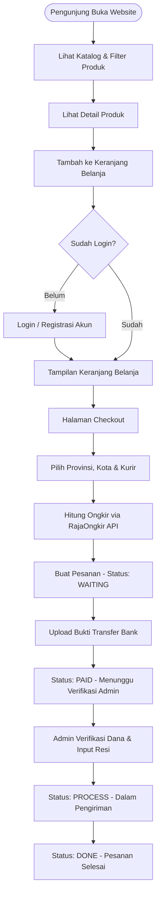

# 02. Product Requirement Document (PRD) - Nomadenstuff E-Commerce

## 1. Gambaran Umum Produk (Product Overview)
**Nomadenstuff E-Commerce System** adalah platform toko online busana (*clothing*) dan produk gaya hidup. Sistem ini dirancang untuk memfasilitasi transaksi online end-to-end mulai dari penjelajahan katalog produk, pencarian produk, pengelolaan keranjang belanja, perhitungan ongkos kirim otomatis berdasar wilayah pengiriman (RajaOngkir API), pembuatan pesanan, upload bukti transfer pembayaran, hingga pengelolaan produk dan laporan pesanan di sisi Administrator.

---

## 2. Target Pengguna & Persona

### A. Customer (Pembeli)
- **Profil**: Pembeli ritel busana yang mencari pakaian pria, wanita, atau unisex secara online.
- **Kebutuhan**: Browsing katalog, pencarian produk, filter berdasarkan gender & kategori, tambah keranjang belanja, kalkulasi ongkir presisi, upload bukti bayar, dan cek status pengiriman resi.

### B. Administrator (Admin Toko)
- **Profil**: Pengelola bisnis toko online.
- **Kebutuhan**: Mengelola katalog barang (CRUD Produk & Kategori), mengelola banner slider promo, memverifikasi bukti bayar pembeli, mengubah status order, menginput nomor resi (*waybill*), dan mengunduh laporan penjualan format PDF.

---

## 3. User Stories & Alur Pengguna (User Flow)

### A. User Stories Customer
1. **Browsing & Search**: *As a Customer*, saya ingin melihat katalog produk terbaru dan memfilter berdasarkan kategori/gender agar dapat menemukan busana yang sesuai.
2. **Cart Management**: *As a Customer*, saya ingin menambahkan produk ke keranjang belanja beserta pesan khusus agar pesanan saya sesuai variasi pilihan.
3. **Checkout & Shipping**: *As a Customer*, saya ingin memilih lokasi kota/kabupaten dan ekspedisi pengiriman agar biaya kirim dapat terhitung secara otomatis dan akurat.
4. **Payment Confirmation**: *As a Customer*, saya ingin mengunggah foto bukti transfer bank agar pembayaran saya dapat diverifikasi oleh admin toko.
5. **Order Tracking**: *As a Customer*, saya ingin melihat riwayat transaksi dan nomor resi pengiriman agar dapat melacak perjalanan paket saya.

### B. User Stories Admin
1. **Catalog Management**: *As an Admin*, saya ingin menambah, mengubah, dan menghapus produk serta kategori agar inventaris toko selalu diperbarui.
2. **Order & Payment Verification**: *As an Admin*, saya ingin memeriksa bukti pembayaran pelanggan dan mengonfirmasi status transaksi agar pesanan dapat segera diproses.
3. **Shipping Resi Input**: *As an Admin*, saya ingin menginput nomor resi (*waybill*) pengiriman pada order agar pelanggan dapat melakukan tracking.
4. **Financial Reporting**: *As an Admin*, saya ingin mengunduh laporan transaksi bulanan dalam format PDF untuk keperluan rekapitulasi keuangan toko.

---

## 4. Diagram Alur Pengguna (User Flow Diagram)

---

## 5. Matriks Kebutuhan Fungsional (Functional Requirements)

| Modul | Requirements ID | Deskripsi Fitur | Prioritas |
| :--- | :--- | :--- | :--- |
| **Authentication** | AUTH-01 | Registrasi akun pembeli baru dengan `is_active = 1` | High |
| **Authentication** | AUTH-02 | Login pembeli dan admin menggunakan verifikasi `password_verify()` | High |
| **Catalog** | CAT-01 | Tampilan produk beranda (Slider banner & produk Pria/Wanita) | High |
| **Catalog** | CAT-02 | Filter produk berdasarkan Kategori, Gender (`L`/`W`/`U`), dan Harga | Medium |
| **Catalog** | CAT-03 | Pencarian produk via keyword dengan session persistence & pagination | High |
| **Cart** | CART-01 | Tambah item ke keranjang dengan pesan opsional & kalkulasi subtotal | High |
| **Cart** | CART-02 | Update kuantitas dan hapus item keranjang terisolasi per `id_user` | High |
| **Checkout** | CHK-01 | Perhitungan otomatis ongkir via RajaOngkir API berdasar kota tujuan | High |
| **Checkout** | CHK-02 | Rekalkulasi total belanja server-side (mencegah *price tampering*) | Critical |
| **Orders** | ORD-01 | Upload bukti pembayaran transfer bank dengan validasi tipe gambar | High |
| **Orders** | ORD-02 | Pelacakan pesanan (Status: `waiting` -> `paid` -> `process` -> `done`/`cancel`) | High |
| **Admin Panel** | ADM-01 | Dashboard statistik (Total User, Produk, Orders, & Order Tercepat) | Medium |
| **Admin Panel** | ADM-02 | Input resi pengiriman (*waybill*) dan pembaruan status order | High |
| **Admin Panel** | ADM-03 | Cetak Laporan PDF Data Order menggunakan Dompdf | Medium |
