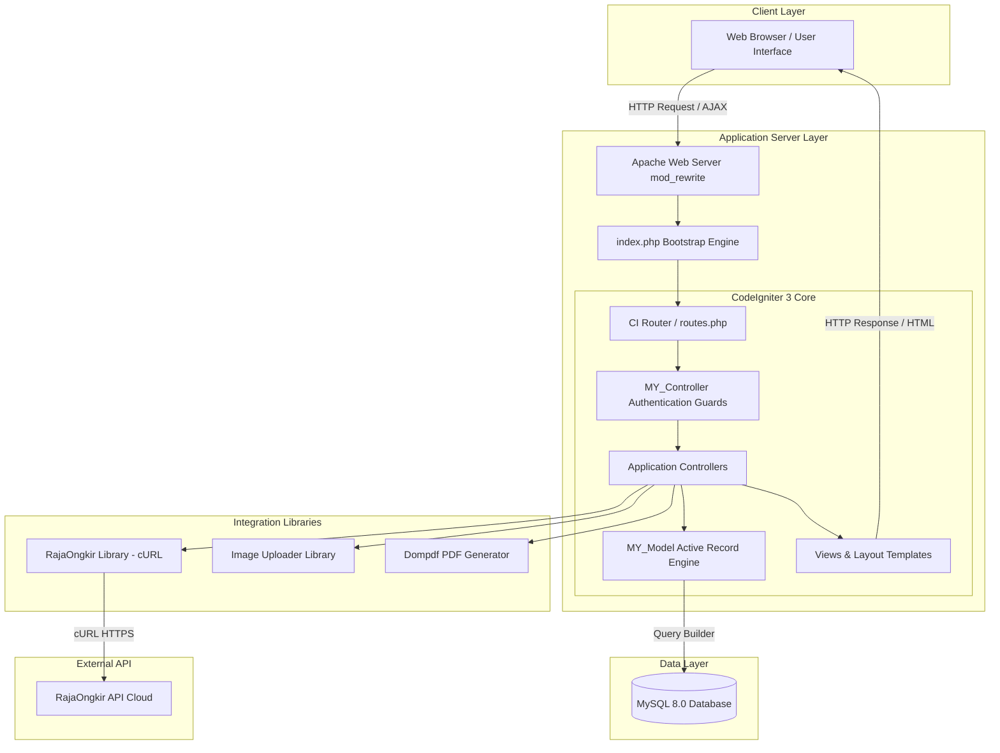

# 04. System Architecture & Technical Specification

## 1. Overview & Teknologi Utama (Tech Stack)

Aplikasi **Nomadenstuff E-Commerce** menggunakan pola arsitektur **Model-View-Controller (MVC)** dengan framework **CodeIgniter 3 (CI3)**.

### Technology Stack Summary:
- **Backend Framework**: PHP 8.2 / 7.4 (CodeIgniter 3.1.13)
- **Frontend Framework**: HTML5, CSS3, JavaScript (jQuery), Bootstrap 4, FontAwesome
- **Database Engine**: MySQL 8.0 / MariaDB
- **Web Server Container**: Apache HTTP Server (Docker Image `php:8.2-apache`)
- **Integrasi Eksternal**: RajaOngkir Starter API (Kurir JNE, POS, TIKI)
- **PDF Engine**: Dompdf 2.0+ (diinstall via Composer)

---

## 2. Diagram Arsitektur Sistem (System Architecture Diagram)



---

## 3. Struktur Direktori Proyek (Directory Structure)

```text
nomadenstuff/
├── application/
│   ├── config/             # Config files (database.php, config.php, routes.php, rajaongkir.php)
│   ├── controllers/        # Application Controllers
│   │   ├── admin/          # Admin Controllers (Admin, Category, Customer, Order, Product, Setting, Slider)
│   │   ├── Cart.php
│   │   ├── Checkout.php
│   │   ├── Home.php
│   │   ├── Login.php / Logout.php / Register.php
│   │   ├── Myorder.php
│   │   ├── Profile.php
│   │   └── Shop.php
│   ├── core/               # Core Extensions (MY_Controller.php, MY_Model.php)
│   ├── helpers/            # Custom Helper Functions (ciolshop_helper.php)
│   ├── libraries/          # Custom Libraries (Image_uploader.php, Rajaongkir.php, Pdfgenerator.php)
│   ├── models/             # Data Models extending MY_Model
│   └── views/              # Layouts & View Templates
│       ├── layouts/        # Shared Header/Footer Layouts (user/app.php, admin/app.php)
│       └── pages/          # View Pages (auth, users, admin)
├── assets/                 # CSS, JS, Fonts, dan Vendor Asset Frontend
├── database/               # Database SQL Schema & Seeds
│   ├── schema.sql
│   └── seeds/
├── docs/                   # Documentation Suite (10 File Standard)
├── images/                 # Uploaded Assets (product, slider, confirm, user)
├── system/                 # CodeIgniter Framework Core
├── tests/                  # Unit & Feature Test Suite (PHP Custom Engine)
├── Dockerfile              # Docker Container Spec (PHP 8.2 Apache)
├── docker-compose.yml      # Docker Multi-Container Configuration (Web + MySQL)
├── index.php               # Application Bootstrap Entry Point
└── vendor/                 # Composer Dependencies (Dompdf)
```

---

## 4. Ekstensi Kelas Utama (Core Class Architecture)

### A. `MY_Controller` (`application/core/MY_Controller.php`)
Setiap controller mewarisi `MY_Controller`, yang menyediakan fungsionalitas:
- **Auto Model Loader**: Otomatis melakukan `load->model()` berdasarkan nama kelas controller yang sedang aktif.
- **Session Guards**:
  - `_requireLogin()`: Memeriksa session `is_login` untuk halaman user (Cart, Checkout, Profile, Myorder).
  - `_requireAdmin()`: Memeriksa session `username` admin untuk seluruh controller di folder `admin/`.
- **View Renderers**: `viewAdmin($data)` dan `view($data)` untuk membungkus konten ke dalam master layout aplikasi secara terstruktur.

### B. `MY_Model` (`application/core/MY_Model.php`)
Menyediakan method fluent Query Builder seragam untuk seluruh model:
- `select($columns)`, `where($column, $condition)`, `like($column, $condition)`, `orLike($column, $condition)`
- `join($table, $type)`: Auto join berdasarkan relasi konvensi `$this->table.id_$table = $table.id`
- `orderBy($column, $order)`
- `first()`, `get()`, `count()`, `create($data)`, `update($data)`, `delete()`
- `paginate($page)`, `calculateRealOffset($page)`, `makePagination($baseUrl, $uriSegment, $totalRows)`

---

## 5. Library Integrasi (Integration Libraries)

1. **RajaOngkir Library (`application/libraries/Rajaongkir.php`)**:
   - Berinteraksi dengan API cURL `https://api.rajaongkir.com/starter/`.
   - Endpoints: `province()`, `city()`, `cost($origin, $destination, $weight, $courier)`.
2. **Image Uploader Library (`application/libraries/Image_uploader.php`)**:
   - Membungkus CodeIgniter Upload Library.
   - Mengatur path upload, pembatasan tipe file (`jpg|gif|png|jpeg`), ukuran maksimal, dan pengubah nama file acak berbasis timestamp.
3. **PDF Generator Library (`application/libraries/Pdfgenerator.php`)**:
   - Menggunakan library `Dompdf` untuk merender template HTML view (`pages/admin/order/report`) menjadi dokumen PDF lanskap A4.

---

## 6. Infrastruktur Cloud & Kontainerisasi (Docker Infra)

Aplikasi siap dideploy menggunakan **Docker & Docker Compose**:
- **Container Web**: Linux Debian / PHP 8.2 Apache dengan ekstensi `gd`, `mysqli`, `pdo_mysql`, `zip`, `mod_rewrite`.
- **Container Database**: MySQL 8.0 Official Image dengan persistent volume `db_data` dan auto-init SQL schema.
