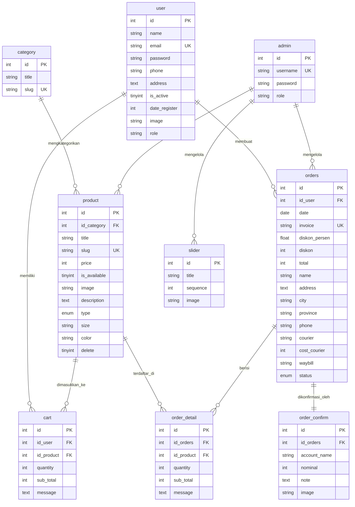

# 05. Database Schema & ERD Documentation

## 1. Overview & Diagram Relasi Entitas (ERD)

Sistem database Nomadenstuff E-Commerce terdiri dari **9 tabel utama** yang saling berhubungan untuk mendukung operasional toko online.

---

## 2. Kamus Data Terperinci (Data Dictionary)

### A. Tabel `user` (Data Akun Pembeli)
Simpan data pelanggan toko online.
| Column | Type | Null | Key | Constraints / Default | Deskripsi Kolom |
| :--- | :--- | :--- | :--- | :--- | :--- |
| `id` | INT(11) | NO | PK | AUTO_INCREMENT | Identifier unik untuk setiap user/pelanggan |
| `name` | VARCHAR(255) | NO | | - | Nama lengkap user |
| `email` | VARCHAR(255) | NO | UK | UNIQUE | Alamat email terdaftar untuk login |
| `password` | VARCHAR(255) | NO | | Bcrypt Hash | Password akun terenkripsi |
| `phone` | VARCHAR(50) | YES | | NULL | Nomor telepon / WhatsApp pelanggan |
| `address` | TEXT | YES | | NULL | Alamat utama pengiriman paket |
| `is_active` | TINYINT(1) | NO | | DEFAULT 1 | Status keaktifan akun (1=Aktif, 0=Nonaktif) |
| `date_register` | INT(11) | NO | | Unix Timestamp | Waktu registrasi akun |
| `image` | VARCHAR(255) | YES | | NULL | Filename foto profil pengguna |
| `role` | VARCHAR(50) | NO | | DEFAULT 'member' | Peran akun pelanggan (`member`) |

---

### B. Tabel `admin` (Data Pengelola Toko)
Simpan data login administrator toko.
| Column | Type | Null | Key | Constraints / Default | Deskripsi Kolom |
| :--- | :--- | :--- | :--- | :--- | :--- |
| `id` | INT(11) | NO | PK | AUTO_INCREMENT | Identifier unik admin |
| `username` | VARCHAR(100) | NO | UK | UNIQUE | Username unik untuk login dashboard |
| `password` | VARCHAR(255) | NO | | Bcrypt Hash | Password admin terenkripsi |
| `role` | VARCHAR(50) | NO | | DEFAULT 'admin' | Hak akses sistem (`admin`) |

---

### C. Tabel `category` (Kategori Produk)
Simpan pengelompokan jenis pakaian.
| Column | Type | Null | Key | Constraints / Default | Deskripsi Kolom |
| :--- | :--- | :--- | :--- | :--- | :--- |
| `id` | INT(11) | NO | PK | AUTO_INCREMENT | Identifier unik kategori |
| `title` | VARCHAR(255) | NO | | - | Nama kategori (mis: Jaket, Kaos, Celana) |
| `slug` | VARCHAR(255) | NO | UK | UNIQUE | URL-friendly slug kategori |

---

### D. Tabel `product` (Katalog Produk)
Simpan informasi detail barang yang dijual.
| Column | Type | Null | Key | Constraints / Default | Deskripsi Kolom |
| :--- | :--- | :--- | :--- | :--- | :--- |
| `id` | INT(11) | NO | PK | AUTO_INCREMENT | Identifier unik produk |
| `id_category` | INT(11) | NO | FK | FK -> `category(id)` | ID relasi ke kategori produk |
| `title` | VARCHAR(255) | NO | | - | Judul/nama produk busana |
| `slug` | VARCHAR(255) | NO | UK | UNIQUE | URL slug unik produk |
| `price` | INT(11) | NO | | - | Harga satuan barang (Rupiah) |
| `is_available` | TINYINT(1) | NO | | DEFAULT 1 | Ketersediaan stok (1=Ada, 0=Habis) |
| `image` | VARCHAR(255) | NO | | - | Filename utama gambar produk |
| `description` | TEXT | YES | | NULL | Deskripsi rinci bahan & spesifikasi |
| `type` | ENUM | NO | | DEFAULT 'U' | Target gender (`L`=Men, `W`=Women, `U`=Unisex) |
| `size` | VARCHAR(50) | YES | | NULL | Ukuran pakaian (S, M, L, XL, All Size) |
| `color` | VARCHAR(50) | YES | | NULL | Varian warna produk |
| `delete` | TINYINT(1) | NO | | DEFAULT 1 | Soft delete flag (1=Aktif, 0=Terhapus) |

---

### E. Tabel `cart` (Keranjang Belanja Transient)
Simpan item produk sementara sebelum checkout.
| Column | Type | Null | Key | Constraints / Default | Deskripsi Kolom |
| :--- | :--- | :--- | :--- | :--- | :--- |
| `id` | INT(11) | NO | PK | AUTO_INCREMENT | Identifier unik item keranjang |
| `id_user` | INT(11) | NO | FK | FK -> `user(id)` | ID pembeli pemilik keranjang |
| `id_product` | INT(11) | NO | FK | FK -> `product(id)` | ID produk yang dipilih |
| `quantity` | INT(11) | NO | | - | Jumlah unit barang yang dibeli |
| `sub_total` | INT(11) | NO | | - | Subtotal harga item (`price * quantity`) |
| `message` | TEXT | YES | | NULL | Catatan/pesan opsional untuk item |

---

### F. Tabel `orders` (Header Transaksi Pesanan)
Simpan data induk transaksi pesanan.
| Column | Type | Null | Key | Constraints / Default | Deskripsi Kolom |
| :--- | :--- | :--- | :--- | :--- | :--- |
| `id` | INT(11) | NO | PK | AUTO_INCREMENT | Identifier unik pesanan |
| `id_user` | INT(11) | NO | FK | FK -> `user(id)` | ID pembeli yang bertransaksi |
| `date` | DATE | NO | | - | Tanggal pesanan dibuat |
| `invoice` | VARCHAR(100) | NO | UK | UNIQUE | Kode unik invoice (`INV/YYYYMMDD/...`) |
| `diskon_persen`| FLOAT | YES | | DEFAULT 0 | Persentase diskon potongan promo |
| `diskon` | INT(11) | YES | | DEFAULT 0 | Nominal rupiah diskon potongan harga |
| `total` | INT(11) | NO | | - | Total tagihan akhir termasuk ongkir |
| `name` | VARCHAR(255) | NO | | - | Nama penerima paket pengiriman |
| `address` | TEXT | NO | | - | Alamat lengkap tujuan pengiriman |
| `city` | VARCHAR(100) | NO | | - | Nama kota/kabupaten tujuan |
| `province` | VARCHAR(100) | NO | | - | Nama provinsi tujuan |
| `phone` | VARCHAR(50) | NO | | - | Nomor telepon penerima paket |
| `courier` | VARCHAR(50) | NO | | - | Kode kurir (`jne`, `pos`, `tiki`) |
| `cost_courier` | INT(11) | NO | | - | Biaya nominal ongkos kirim |
| `waybill` | VARCHAR(100) | YES | | NULL | Nomor resi pengiriman dari ekspedisi |
| `status` | ENUM | NO | | DEFAULT 'waiting' | Status order (`waiting`,`paid`,`process`,`done`,`cancel`) |

---

### G. Tabel `order_detail` (Rincian Item Pesanan)
Simpan rincian produk dalam tiap pesanan.
| Column | Type | Null | Key | Constraints / Default | Deskripsi Kolom |
| :--- | :--- | :--- | :--- | :--- | :--- |
| `id` | INT(11) | NO | PK | AUTO_INCREMENT | Identifier unik rincian item order |
| `id_orders` | INT(11) | NO | FK | FK -> `orders(id)` | ID relasi ke header pesanan |
| `id_product` | INT(11) | NO | FK | FK -> `product(id)` | ID produk yang dibeli |
| `quantity` | INT(11) | NO | | - | Kuantitas unit yang dibeli |
| `sub_total` | INT(11) | NO | | - | Subtotal nominal harga item |
| `message` | TEXT | YES | | NULL | Catatan khusus per item barang |

---

### H. Tabel `order_confirm` (Bukti Konfirmasi Pembayaran)
Simpan berkas konfirmasi transfer bank.
| Column | Type | Null | Key | Constraints / Default | Deskripsi Kolom |
| :--- | :--- | :--- | :--- | :--- | :--- |
| `id` | INT(11) | NO | PK | AUTO_INCREMENT | Identifier unik konfirmasi |
| `id_orders` | INT(11) | NO | FK | FK -> `orders(id)` | ID pesanan yang dibayar |
| `account_name` | VARCHAR(255)| NO | | - | Nama pemilik rekening pengirim |
| `nominal` | INT(11) | NO | | - | Nominal uang yang ditransfer |
| `note` | TEXT | YES | | NULL | Catatan tambahan pembayaran |
| `image` | VARCHAR(255) | NO | | - | Filename gambar bukti transfer |

---

### I. Tabel `slider` (Banner Slider Beranda)
Simpan banner promosi di halaman utama.
| Column | Type | Null | Key | Constraints / Default | Deskripsi Kolom |
| :--- | :--- | :--- | :--- | :--- | :--- |
| `id` | INT(11) | NO | PK | AUTO_INCREMENT | Identifier unik banner slider |
| `title` | VARCHAR(255) | NO | | - | Judul banner promosi |
| `sequence` | INT(11) | NO | | - | Urutan tampil di carousel |
| `image` | VARCHAR(255) | NO | | - | Filename berkas gambar banner |
